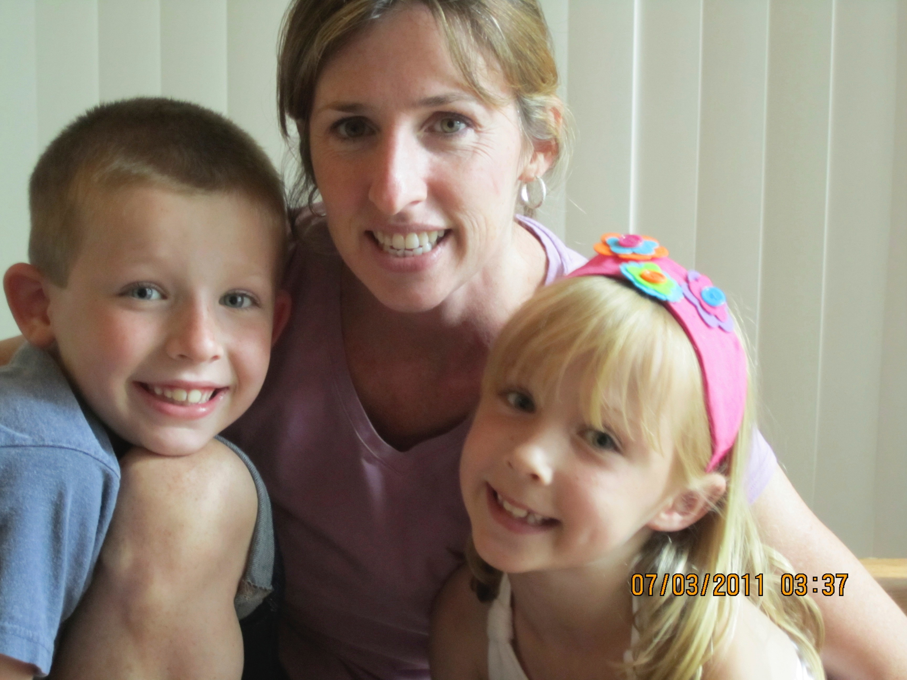

# 2010-2015

## Dad

I am sure you know why I chose to make this next segment start at 2010. Not a great year for the Seely family. I remember coming home and being told that Dad had passed away, and everything changed. The one thing that did not change was how much love and support you gave to me and Em. 

Mom, I cannot even begin to imagine what that must have felt like for you. Not only did your husband and your best friend pass away, but also your life partner who was always supposed to raise us. Naturally, the three of us were hurting pretty bad, but I could never forget how, despite that, you carried on so well. I think I have told you this before, but it is worth repeating. Although it was awful to lose Dad, I never felt like I lost out on my parenting. I don't have anything to compare it to, but I always felt so loved and cared for. You worked so hard to keep us going, all while grieving that loss. I respect and appreciate you infinitely for that.

## Work, School, Home

During this time, I remember that you took one day off each week. Thank God for the OIG! School was a blast during this time period. We had some great times at the Green Meadow Elementary School (minus Mrs. Baldwin's BS). It was during this time period that we started going to all of Em's basketball games together. That was so much fun for me. I am sure it was often stressful for you, but I loved going with you and asking you "What just happened?" when I would get distracted. 

Something I remembered recently was how, when Coach Hammond called to tell you that I was receiving a new award at Green Meadow, that you cried. I think that is so sweet, and goes to show how much you care for us and root for our success. It shows! And it goes a long way.

This idea can transfer into the next sections, but I will put it here, as I think this is when it started. Sorry for causing you so much trouble! Wow, I was so combative from the start. At least I wasn't a menace at school? I think it's incredibly funny and creative how you wrote a note from our Elf on the Shelf about how I needed to be better to you. LOL! 

Anyway, my main point of this section is that I appreciate you greatly for your parenting and your resilience during this period. You killed it, Mom, and under some pretty tough conditions. I love you, and I hope that one day I get the opportunity to be as amazing as a parent as you were during this time, when my kids are young.