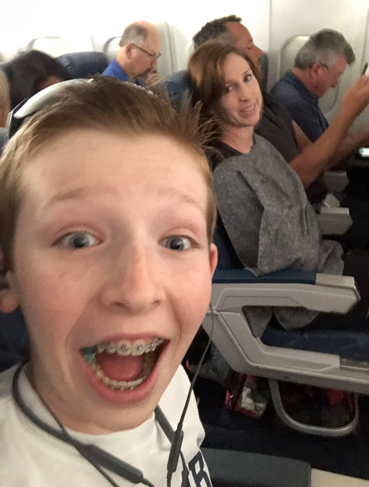
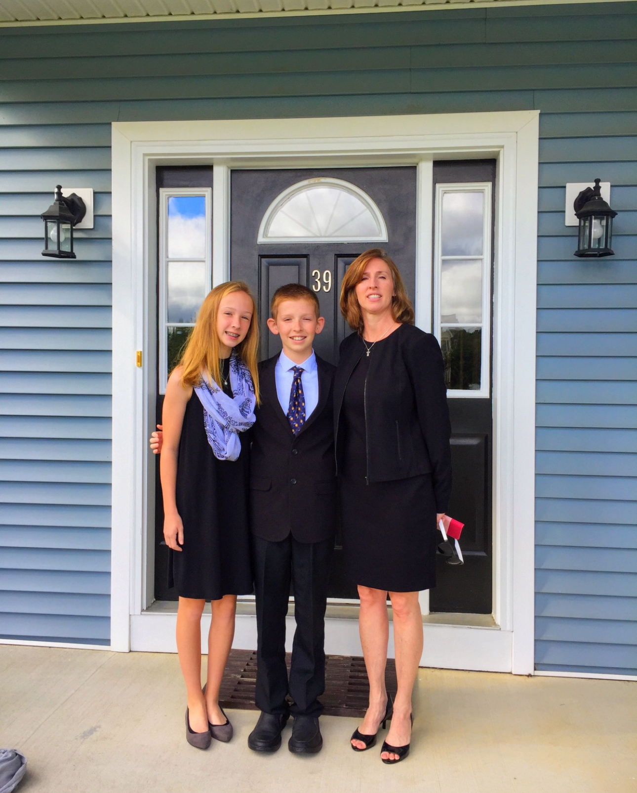

# 2015-2018

## Middle School Years

Middle school was an interesting time. The same themes from the last part most certainly carry into here. I don't really have a ton to say on this time period, but I wanted to give this particular story some attention, because of how meaningful it is to me.

In Sixth grade, some random girl just came up to me and said something along the lines of "You know that people say you're gay, right?" Woah! I had no idea that I was gay at that point, like that wasn't really a thought in my mind. Then, I told Emily, Emily told the lunch monitor, the lunch monitor told the Assistant Principal, Mrs. Barker, and Mrs. Barker told you. 

When I got home that day, you addressed it with me. You told me that you would love me no matter what. I cannot even begin to express how important that was for me. I don't really remember middle school very well. It is not something I love to think about because I was somewhat "othered" for being gay. But I remember this part very well. After you told me that, you just snuggled me on your bed, with the sun shining through your bedroom window. Your reaction to that event was simply perfect. 

In the moment, it was not something that I thought was so important. But it means the world to me. You never did anything that made me think you wouldn't support me, but it was so valuable to have that verbalized support for me. It was why I wasn't scared to call you this March. I love you very much, Mama, and I could not have asked for or found a more supportive parent. 

## Cross Country

The other thing that jumps to mind of this period is that I started running cross country. I think you showed up to at least 98% of our track and cross country meets. I think that I took it for granted that you would always be there for me. And you always have been! How lucky am I? Anyway, thank you for always showing up. I know that we were often rushing to get to one place to the next, but please know that your presence during this time is something that will stick with me. Your dedication to us has always showed, even if I didn't appreciate it enough at the time.

## Some Pictures

I scrounged up all the pictures I could find from this time period. Here are my favorites.

